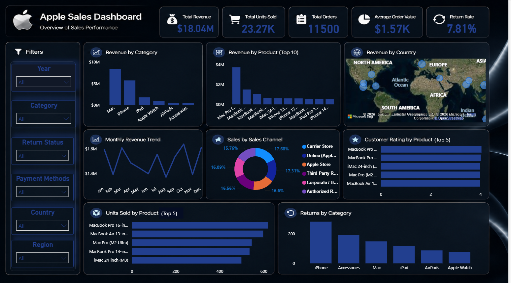

# 🍎 Apple Sales Dashboard (Power BI)

## 📌 Project Overview

This project analyzes Apple global sales data using Microsoft Power BI to provide interactive visualizations and actionable business insights.

The dashboard helps track revenue, orders, product performance, sales channels, customer ratings, and return rates through dynamic reports.

---

## 📊 Dashboard Preview

---

## 🛠 Tools & Technologies

- Microsoft Power BI
- Power Query
- DAX
- Microsoft Excel

---

## 📈 Dashboard Features

- Interactive KPI Cards
- Revenue by Category
- Revenue by Product (Top 10)
- Revenue by Country
- Monthly Revenue Trend
- Sales by Sales Channel
- Customer Rating by Product
- Units Sold by Product
- Returns Analysis
- Interactive Slicers

---

## 📌 Key KPIs

- Total Revenue
- Total Orders
- Total Units Sold
- Average Order Value
- Return Rate

---

## 📂 Dataset

Dataset Source:
Apple Global Sales Dataset (Kaggle)

---

## 📁 Files

- Apple Sales.pbix
- Dashboard.png
- apple_global_sales_dataset.csv

---

## 👨‍💻 Author

Peter Gerges
